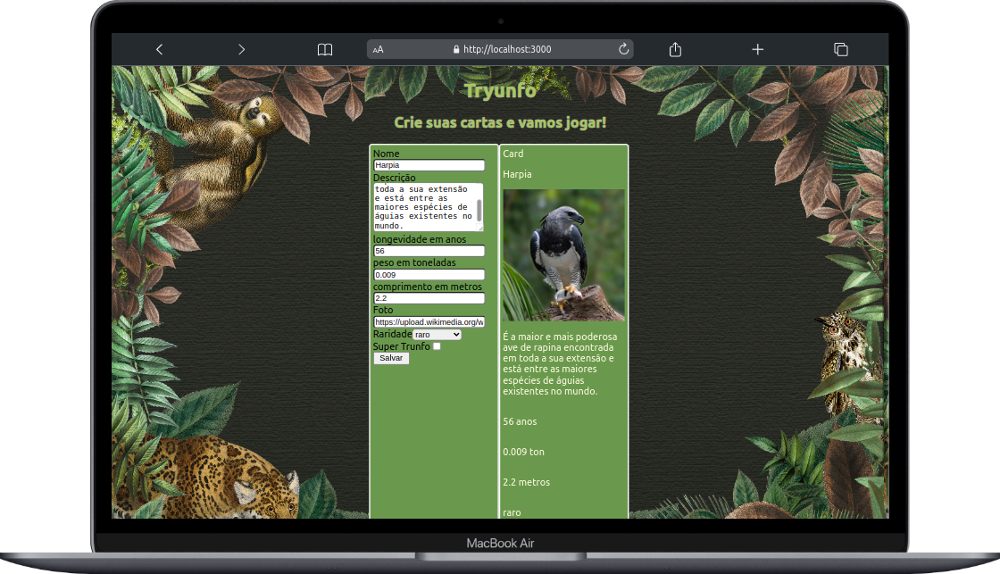
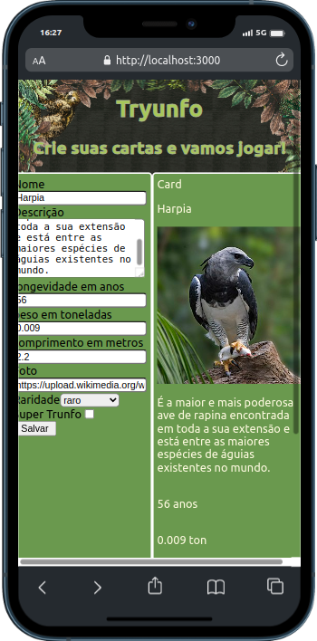

# Project Tryunfo

  

  

## 📝 Proposta:
Neste projeto desenvolveu-se um jogo no estilo Super Trunfo, em que é possível criar novas cartas e listar as cartas já existentes no baralho. Tudo isso de forma dinâmica, usando formulários e o estado da aplicação.

Este projeto foi desenvolvido no curso de desenvolvomento web da Trybe no módulo de Front-End e conta com o uso de React.

## 💡 Habilidades desenvolvidas:

- O uso de estados de componentes em React, assim como captura de eventos e formulários.

---

🔗 [Linkedin ricardo-kühlkamp-dev](linkedin.com/in/ricardo-kühlkamp-dev)

---
